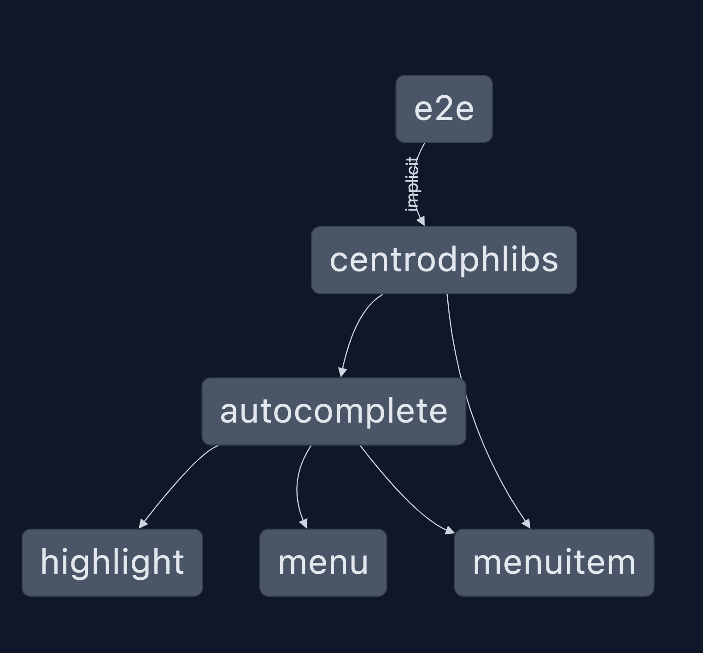

# Base on nx monorepo setup

## Setup the application

Run `pnpm install` to install the dependencies.

## Start the application

Run `pnpm run start` to start the development server. Happy coding!

